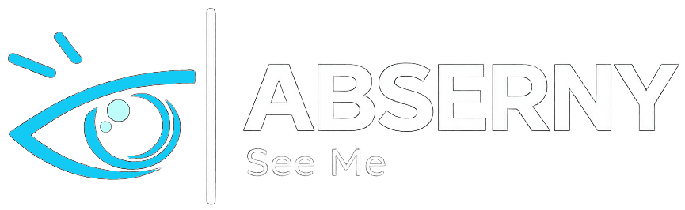

# Object Detection for the Visually Impaired

---

We truly appreciate any kind of support, not necessarily financial. For example, if someone wants to help improve our logo or banner, or if someone has stronger knowledge in machine learning and computer vision and can help us improve both our code and our understanding in these areas, we would be very happy to welcome their contribution.

For those interested in contributing, please review the project blueprints first:

- [References & Sources](https://github.com/VissionX/Visiondocs)
- [contributing Guide](https://github.com/VissionX/Visiondocs/blob/main/ContributingGuide.md)

Contribution [Roles]() & [Why?]() :

- Graphic Designer *(To **Enhancec** project logo and banner)*
- Someone who has knoledge about **jekyll** *(To keep track and **document** our Progression)*
- Someone who has Github Fundamentals *(To **Optimeze** and lead Commits and stuff)*

Communications :
- Email : alsaeedalbasi0ny@gmail.com

---

<i>- Developed mainly as a Graduation project -</i>

<a href="https://abserny.github.io/abserny.com/">Main Website</a> | <a href="https://abserny.github.io/abserny.org/">Documentation</a>

