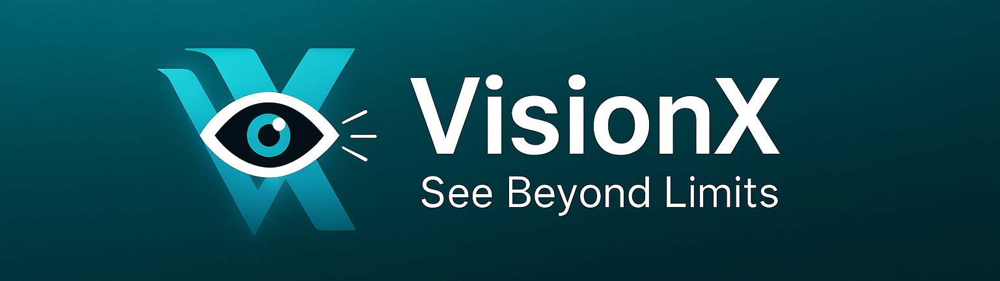

## Welcome to VisionX 

> \[!IMPORTANT]
> VisionX is currently Under Development. You could use a [Core](https://github.com/VissionX/VisionX)  version if you want to see what is going on.

For those interested in contributing, please review the project blueprints first:

- [References & Sources](https://github.com/VissionX/Visiondocs)
- [contributing Guide](https://github.com/VissionX/Visiondocs/blob/main/ContributingGuide.md)

## Core Projects Overview

| No. | Repository       | Stars | Forks | Watchers | Issues | Language | Size (KB) | Contributors | Last Updated   |
|-----|------------------|-------|-------|----------|--------|----------|-----------|--------------|----------------|
| 1   | VisionX          | 3     | 0     | 3        | 1      | Python   | 47,665    | ~1–2         | 2025-12-26     |
| 2   | VisionX-Mobile   | 0     | 0     | 0        | 0      | —        | 3         | 1            | 2025-12-26     |
| 3   | VisionX-asr      | 0     | 0     | 0        | 0      | Python   | 5         | 1            | 2025-12-27     |
| 4   | Visiondocs       | 1     | 0     | 1        | 0      | Mermaid  | 260       | 1            | 2026-01-14     |
| **Total**        | —     | **4** | **0** | **4**    | **1**  | —        | **47,933**| —            | —              |

For more details you may see our website from here →  [VisionX](vissionx.github.io/VisionX.x/)

