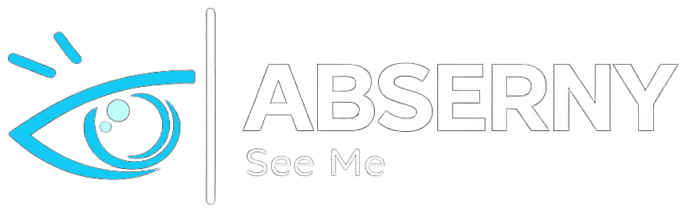
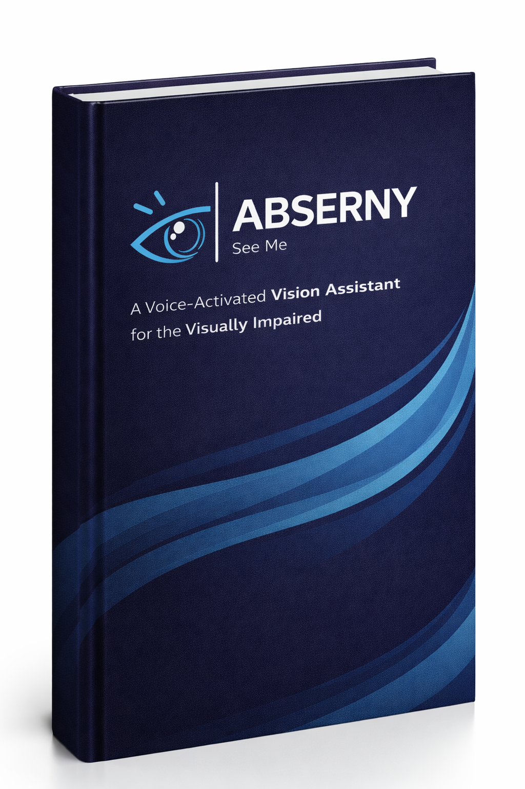

# Voice-Activated Vision Assistant for the Visually Impaired

---

We truly appreciate any kind of support, not necessarily financial. For example, if someone wants to help improve our logo or banner, or if someone has stronger knowledge in machine learning and computer vision and can help us improve both our code and our understanding in these areas, we would be very happy to welcome their contribution.

For those interested in contributing, please review the project blueprints first:

- [References & Sources](https://github.com/VissionX/Visiondocs)
- [contributing Guide](https://github.com/VissionX/Visiondocs/blob/main/ContributingGuide.md)

Contribution Roles & Why? :

- Graphic Designer *(To **Enhance** project logo and banner)*
- Someone who has knowledge about **jekyll** *(To keep track and **document** our Progression)*
- Someone who has Github Fundamentals *(To **Optimize** and lead Commits and stuff)*

## Graduation Book Announced

<table>
<tr>
<td width="50%" align="left">

### Explore the Full Vision

This book contains a complete breakdown of the **Abserny Project** — from idea to implementation.

- System Architecture
- AI & Object Detection Pipeline
- Design Decisions & Philosophy
- Future Vision & Expansion

Built to reflect not just *what we built*, but *how we think*.

 

</td>

<td width="50%" align="center">

</td>
</tr>
</table>

Communications :
- Email : alsaeedalbasi0ny@gmail.com

---

<i>- Developed mainly as a Graduation project -</i>

<a href="https://abserny.github.io/">Main Website</a> | <a href="https://abserny.github.io/abserny.org/">Documentation</a>

